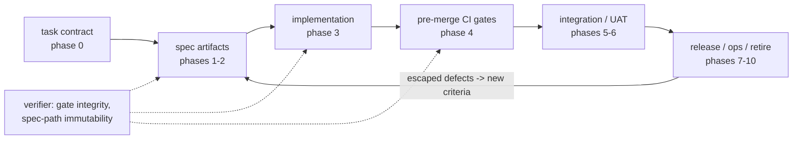

# Map - sdlc_development_kit

> **Contract** - one question: *what are the pieces, and how do they connect?*
> <=2 pages - update on add / remove / rewire of a Component - hand-edited.

## Diagram

<!-- The ONE diagram in this project, at ~C4 container zoom. Anything deeper
     rots faster than you can maintain it - use the table below for detail. -->

## Components
<!-- One row per piece - one-line responsibility - link the deep doc once it exists (else "no doc yet"). -->

| Component | Responsibility (one line) | Status | Deep doc |
|---|---|---|---|
| gate map | Unified SDLC gate table: phases 0-10, what each authors vs enforces, defect classes closed | designed | [docs/gates.md](docs/gates.md) |
| bug-class taxonomy | CWE/ODC anchors -> gate mapping with detectability-ladder position per class | designed | [docs/taxonomy.md](docs/taxonomy.md) |
| spec-first gate catalog | The 8 gate patterns: immutable acceptance tests, API lock, property specs, contracts, approvals, differential, mutation floor, formal models | designed | [docs/catalog.md](docs/catalog.md) |
| task-contract schema | Phase-0 definition-of-ready: dual-profile JSON Schema + `taskcontract` validator (TCnnn diagnostics) | implemented (v1) | [docs/task-contract.md](docs/task-contract.md) |
| REQ-ID traceability | Criterion-annotation format + CI script requiring every REQ-ID -> >=1 passing test | designed | [decisions/0011](decisions/0011-criterion-traceability-format.md) |
| custom analyzers | House conventions encoded as Roslyn analyzers + code fixes (fed by convention extraction) | planned | no doc yet |
| verifier checks | Write-surface immutability + suppression audit (one diff job, G4.6 + G4.10) + enforcement-layer change control; suppression half shipped as `taskcontract suppression-audit` (0.7.0) | partial (v1) | [decisions/0010](decisions/0010-write-surface-immutability.md) |
| pilot stack | Minimal phase 3-4 stack (formatter, StyleCop, strict compile, arch tests, ratchets) on a pilot repo | planned | no doc yet |
| distribution skill | `/sdlc` init + intake (F10) + new (F11) + audit + vocab family: the kit's delivery vehicle - no-clobber gate-spine scaffold, Cairn-shaped, marketplace-installable | implemented (v1) | [decisions/0016](decisions/0016-distribution-before-activation.md) |
| vocabulary layer | Executable shared language: glossary door (VT/VC), `entities:` + G0.2 coverage join (ratified-only, fork semantics), class-E constraint registry, `/sdlc vocab` family; kit self-hosted as consumer 2 | implemented (v1) | [docs/vocabulary.md](docs/vocabulary.md) |
| distribution reconciliation | Consumer-side update story: tagged install pins (tag-on-bump), CHANGELOG.md migration notes, `/sdlc update` scaffold-drift engine (report-only, per-file consented apply) | implemented (v1) | [docs/distribution.md](docs/distribution.md) |
| tooling profiles | Per-stack template overlays (`profiles/{stack}/profile.json`) the stack answer selects at init/update; dotnet carries G3's inner loop + G4's mechanical core (strict props + locked-graph audit, editorconfig, merge-gate workflow, formatter hook - classes per ADRs 0019/0020) | implemented (v1) | [docs/dotnet-profile.md](docs/dotnet-profile.md) |
| operator layer | Agent personas that drive gates green from verdicts: the Two-Key pair shipped as plugin `agents/` (developer, verifier), venue map over all 13 gates, verdict + loop contracts normative, profile `commands:` bindings; spec + qa registered | implemented (v1) | [docs/operators.md](docs/operators.md) |

Design source: `HANDOFF_gate-architecture_2026-07-22.md` (root, frozen). The
gate map lives as the registry `docs/gates.md` (gates G0-G10 + PL-*, with
condition rosters and per-gate deep pages under `docs/gates/`); taxonomy and
catalog detail live in `docs/taxonomy.md` and `docs/catalog.md`.
