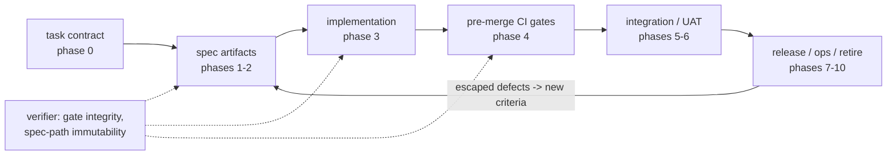

# Map - sdlc_development_kit

> **Contract** - one question: *what are the pieces, and how do they connect?*
> <=2 pages - update on add / remove / rewire of a Component - hand-edited.

## Diagram

<!-- The ONE diagram in this project, at ~C4 container zoom. Anything deeper
     rots faster than you can maintain it - use the table below for detail. -->

## Components
<!-- One row per piece - one-line responsibility - link the deep doc once it exists (else "no doc yet"). -->

| Component | Responsibility (one line) | Status | Deep doc |
|---|---|---|---|
| gate map | Unified SDLC gate table: phases 0-10, what each authors vs enforces, defect classes closed | designed | [docs/gates.md](docs/gates.md) |
| bug-class taxonomy | CWE/ODC anchors -> gate mapping with detectability-ladder position per class | designed | no doc yet |
| spec-first gate catalog | The 8 gate patterns: immutable acceptance tests, API lock, property specs, contracts, approvals, differential, mutation floor, formal models | designed | no doc yet |
| task-contract schema | Phase-0 definition-of-ready: scope, non-goals, gateable decomposition | planned | no doc yet |
| REQ-ID traceability | Criterion-annotation format + CI script requiring every REQ-ID -> >=1 passing test | planned | no doc yet |
| custom analyzers | House conventions encoded as Roslyn analyzers + code fixes (fed by convention extraction) | planned | no doc yet |
| verifier checks | Spec-path immutability diff check + enforcement-layer change control | planned | no doc yet |
| pilot stack | Minimal phase 3-4 stack (formatter, StyleCop, strict compile, arch tests, ratchets) on a pilot repo | planned | no doc yet |

Design source: `HANDOFF_gate-architecture_2026-07-22.md` (root, frozen). The
gate map now lives as the registry `docs/gates.md` (gates G0-G10 + PL-*, with
condition rosters); taxonomy and catalog detail stay in the handoff until each
gets its `docs/` page on touch.
